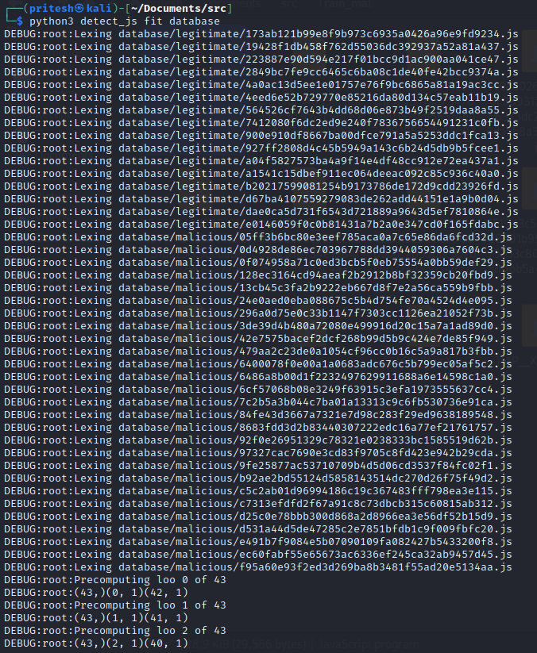

# JavaScript Malware Analysis

## Overview

Tool designed for the classification of JavaScript files as malicious or legitimate. It leverages machine learning techniques to analyze JavaScript code and determine its potential threat level. This tool can be particularly useful for security researchers and professionals working in malware analysis and detection.

## Table of Contents
- [Features](#features)
- [Installation](#installation)
- [Usage](#usage)
- [Example](#example)
- [Conclusion](#conclusion)
- [License](#license)
- [Acknowledgements](#acknowledgements)
- [Contact Information](#contact-information)

## Features

- **Static Analysis**: Analyze JavaScript files without executing them.
- **Machine Learning**: Use various machine learning algorithms for classification.
- **Database Management**: Maintain a database of JavaScript samples with metadata.
- **Logging**: Keep detailed logs of analysis and classification activities.

## Installation

### Prerequisites

- Python 3.x
- Required Python libraries (install using `pip`):
  - docopt
  - sklearn
  - slimit
  - requests
  - matplotlib
  - seaborn
  - numpy
  - scipy

### Installation Steps

1. Clone the repository:
   ```bash
   git clone https://github.com/Devil-Code/Javascript-Malware-Analysis.git
   cd Javascript-Malware-Analysis
   ```

2. Install the required libraries:
   ```bash
   pip install -r requirements.txt
   ```

## Usage

The tool provides three main commands: `add`, `fit`, and `predict`.

### Add JavaScript File to Database

Add a JavaScript file to the database, classifying it as malicious, legitimate, or unknown.

```bash
detect_js add [-f] [-m|-l|-u] <database> <js-file> [<message>]
```

- `-m` : Mark the file as malicious.
- `-l` : Mark the file as legitimate.
- `-u` : Mark the file as unknown (default).
- `-f` : Force the update if the file already exists with a different classification.
- `<database>` : Path to the database.
- `<js-file>` : Path to the JavaScript file.
- `<message>` : Optional message for logging.

### Train the Classifier

Train the machine learning model using the JavaScript files in the database.

```bash
detect_js fit <database>
```

- `<database>` : Path to the database.

### Predict JavaScript File Classification

Predict whether a JavaScript file is malicious or legitimate.

```bash
detect_js predict <database> <js-file>
```

- `<database>` : Path to the database.
- `<js-file>` : Path to the JavaScript file.

## Example

Add a JavaScript file to the database as malicious:

```bash
detect_js add -m /path/to/database /path/to/malicious.js "Initial malicious sample"
```


File already present in database.


File not present in database.

Train the classifier:

```bash
detect_js fit /path/to/database
```




Predict the classification of a new JavaScript file:

```bash
detect_js predict /path/to/database /path/to/unknown.js
```


Predict!


Predict Options!!!

## License

This project is licensed under the GNU GPL v3.0 License. See the [LICENSE](LICENSE) file for details.

Contributions are welcome! Please fork this repository and submit pull requests for any improvements or bug fixes.

## Acknowledgements

This project uses the following libraries:
- docopt
- sklearn
- slimit
- requests
- matplotlib
- seaborn
- numpy
- scipy
- jsitbad

## Contact Information

For any inquiries or issues, please contact:
- **Pritesh Gandhi**
- **Email**: pgandhi1412@gmail.com
- **GitHub**: [GitHubProfile](https://github.com/Devil-Code)
